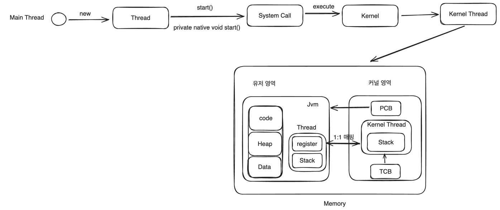
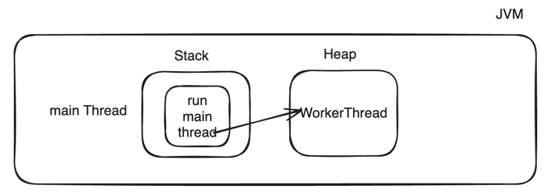
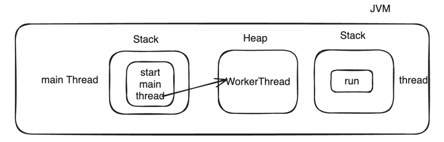
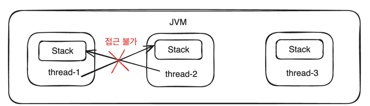
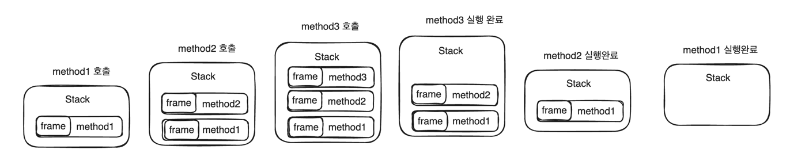
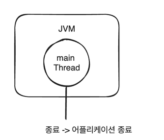
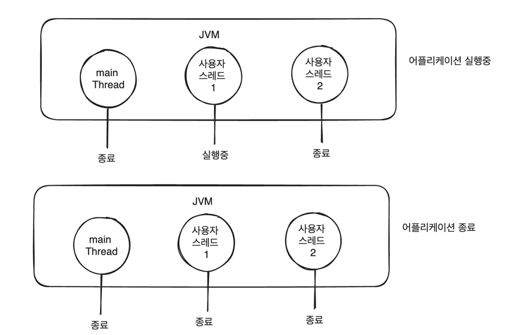
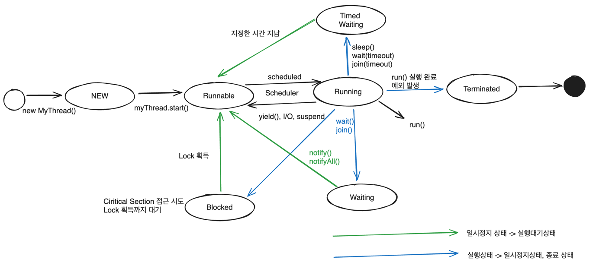

# 스레드 생성
## 개요
- 자바 스레드는 JVM에서 사용자 수준 스레드(User Thread)를 생성할 때 시스템 콜을 통해서 커널에서 생성된 커널 스레드와 1:1 매핑이 되어 최종적으로 커널에서 관리된다.
- JVM에서 스레드를 생성할때마다 커널에서 자바 스레드와 대응하는 커널 스레드를 생성한다.
- 자바에서는 Platform Thread로 정의되어 있다 .즉 OS 플랫폼에 따라 JVM이 사용자 스레드를 매핑하게 된다.


## Thread 구조


## 스레드 생성 하는 방법

1. Thread 클래스 상속하는 방법


- 작업 내용을 스레드 내부에 직접 재정의해서 실행

2. Runnable 인터페이스를 구현하는 방법


- 작업내용을 Runnable에 정의해서 스레드에 전달하면 스레드는 Runnable을 실행


## 다양한 스레드 생성 패턴

1. Thread 클래스 상속하는 방법
- 가장 기본적인 방식이며 Thread 클래스를 반드시 상속받아야 한다.
- 상속의 특성상 컴파일 타임 시점에 실행코드가결정되어 동적인 기능 변경이 불가능하다는 단점이 있음.

2. Thread 익명 클래스


- 스레드 객체를 참조하거나 재활용하지 않고 일회용으로만 사용할 겨웅

3. Runnable 인터페이스를 구현하는 방법
- Runnable을 태스크로 활용하는 방식으로서 선호하는 방식
- 스레드와 실행하고자 하는 태스크를 분리함으로써 좀 더 유연하고 확장 가능한 구조로 구현이 가능

4. Ruunable 익명 클래스


- Runnable 타입을 참조하거나 재활용하지 않고 일회용으로만 사용할 경우

5. Runnable 람다 방식


- Runnable을 람다 형식으로 구현함으로써 코드가 간결해진다.


# 스레드 실행 및 종료 - start() & run()


## 개요
- 자바 스레드는 운영체제 스케줄러에 의해 실행 순서가 결정되며 스레드 실행 시점을 JVM에서 제어할 수 없습니다.
- 새로운 스레드는 현재 스레드와 독립적으로 실행되고 최대 한번 시작할 수 있고 스레드가 종료된 후에는 다시 시작할 수 없습니다.

## 스레드 실행
- start() : 스레드를 실행키는 메서드로 시스템 콜을 통해서 커널에 커널 스레드 생성을 요청



1) 메인스레드가 새로운 스레드를 생성합니다.
2) 메인스레드가 start() 메서드를 호출해서 스레드 실행을 시작합니다.
3) 내부적으로 네이티브 메서드인 start()를 호출해서 커널에게 커널 스레드를 생성하도록 시스템 콜을 요청합니다.(native가 붙은 메서드는 java에서 어떤 API를 수행하려는 것이 아니라 그 밑단의 커널 또는 운영체제의 도움을 받기 위해서 시스템 콜을 요청하기 위한 메서드입니다.)
4) 커널 스레드가 생성되고 자바 스레드와 커널 스레드가 1:1 매핑이 이루어집니다.
5) 커널 스레드는 OS 스케줄러로부터 CPU 할당을 받기까지 실행대기 상태에 있습니다.
6) 커널 스레드가 스케줄러에 의해 실행상태가 되면 JVM에서 매핑된 자바 스레드의 run() 메서드를 호출합니다.


- run()
  - 스레드 실행이 되면 해당 스레드에 의해 자동으로 호출되는 메서드입니다.
  - Thread의 run이 자동 호출되고 여기서 Runnable 구현체가 존재할경우 Runnable의 run()을 실행하게 됩니다.
  - public static void main(String[] args)가 메인스레드에 의해 자동으로 호출되는것과 비슷한 원리입니다.
  - 주의할것은 만약 start가 아닌 run() 메서드를 직접 호출하면 새로운 스레드가 생성되지 않고 직접 호출한 스레드의 실행 스택에서 run()이 실행될뿐입니다.

```java
Thread thread = new WokerThread();
thread.run();
```


```java
Thread thread = new WokerThread();
thread.start();
```



## 스레드 스택(Stack)
- 스레드가 생성되면 해당 스레드를 위한 스택이 같이 만들어진다.
- 스택은 각 스레드마다 독립적으로 할당되어 작동하기 때문에 스레드 간 접근하거나 공유할 수 없고 이는 스레드로부터 안전하다고 할 수 있습니다.
- 스택은 운영체제에 따라 크기가 주어지고 크기를 넘기게 되면 StackOverFlowError 발생합니다.



## 스택의 구성 정보
- 스택에 대한 메모리 접근은 Push & Pop에 의한 후입선출(LIFO) 순서로 이루어지며 스택은 프레임(Frame)으로 구성되어 있습니다.
- 프레임은 새 메서드를 호출할때마다 로컬변수(지역변수, 파라미터) 및 객체 참조변수와 함께 스택의 맨 위에 생성(push)되고 메서드 실행이 완료되면 해당 스택 프레임이 제거(pop) 되고 흐름이 호출한 메서드로 돌아가며 공간이 다음 메서드에 사용 가능해집니다.

```java
public void method1() {
    method2();
}
public void method2() {
    method3();
}
public int method3() {
    return 1;
}
```



## 스레드 종료
- 스레드는 run() 메서드의 코드가 모두 실행되면 스레드는 자동으로 종료한다.
- 스레드는 예외가 발생할 경우 종료되며 다른 스레드에 영향을 미치지 않습니다.
- 어플리케이션은 싱글 스레드인 경우와 멀티스레드인 경우 종료 기준이 다릅니다.

### 싱글 스레드



- 싱글스레드는 사용자스레드가 없는 기본 main thread만 있는 상태입니다.
- main thread만 종료되면 어플리케이션이 종료됩니다.

### 멀티 스레드



- 멀티스레드인 경우 JVM에서 실행하고 있는 모든 스레드가 종료되어야 어플리케이션이 종료됩니다.
- 동일한 코드를 실행하는 각 스레드의 종료 시점은 처리 시간 및 운영체제의 스케줄링에 의해 결정되므로 매번 다르게 나올 수 있습니다.


스레드 유형이 데몬 스레드일 경우 위 내용과 일부 다른점이 존재


# 스레드 생명주기와 상태

## 개요
- 자바 스레드는 생성과 실행 그리고 종료에 따른 상태를 가지고 있으며 JVM에서는 6가지 스레드 상태가 존재합니다. 커널 스레드 상태를 의미하지 않습니다.
- 자바 스레드는 어떤 시점이든 6가지 상태 중 오직 하나의 상태를 가질 수 있습니다.
- 자바 스레드의 현재 상태를 가져오려면 Thread의 getState() 메서드를 사용하여 가져올 수 있습니다.
- Thread 클래스에는 스레드 상태에 대한 ENUM 상수를 정의하는 Thread.State 클래스를 제공.

## 스레드 상태
<table>
  <tr>
    <td>상태</td>
    <td>ENUM</td>
    <td>설명</td>
  </tr>
  <tr>
    <td>객체 생성</td>
    <td>NEW</td>
    <td>스레드 객체가 생성됨, 아직 시작되지 않은 스레드 상태</td>
  </tr>
  <tr>
    <td>실행 대기</td>
    <td>RUNNABLE</td>
    <td>실행중이거나 실행 가능한 스레드 상태</td>
  </tr>
  <tr>
    <td>일시 정지</td>
    <td>WAITING</td>
    <td>대기중인 스레드 상태로서 다른 스레드가 특정 작업을 수행하기를 기다린다.</td>
  </tr>
  <tr>
    <td>일시 정지</td>
    <td>TIMED_WAITING</td>
    <td>대기시간이 지정된 스레드 상태로서 다른 스레드가 특정 작업을 수행하기를 기다린다.</td>
  </tr>
  <tr>
    <td>일시 정지</td>
    <td>BLOCKED</td>
    <td>모니터 락(Lock)이 해제될때까지 기다리며 차단된 스레드 상태</td>
  </tr>
  <tr>
    <td>종료</td>
    <td>TERMINATED</td>
    <td>실행이 완료된 스레드 상태</td>
  </tr>
</table>

# 스레드 생명 주기



### 참고 - Running 상태
- 스레드에는 없는 상태정보이나 저체 생명주기 흐름을 이해하기 위해 실행중인 상태로 표시한것이며 Runnable 상태에 포함된 개념이라 볼 수 있음.

## 객체 생성 상태(new MyThread -> NEW(상태))
- 스레드 객체는 생성 되었지만 아직 start() 하지 않은 상태로서 JVM에는 객체가 존재하지만 아직 커널로의 실행은 안된 상태라 볼 수 있습니다.

## 실행 대기상태(myThread.start -> Runnable(상태))
- start()를 실행하면 내부적으로 커널로의 실행이 일어나고 커널 스레드로 1:1 매핑된다.
- 스레드는 바로 실행 상태가 아닌 언제든지 실행할 준비가 되어있는 실행 가능한 상태가 된다.
- 스레드가 실행한 상태로 전환하기 위해서는 현재 스레드가 어떤 상태로 존재하든지 반드시 실행 대기 상태를 거쳐야한다.

## 스케줄링(scheduler)
- 실행 가능한 상태의 스레드에게 실행할 시간을 제공하는것은 운영체제 스케줄러의 책임이다.
- 스케줄러는 멀티 스레드 환경에서 각 스레드에게 고정된 시간을 할당해서 실행 가능한 상태를 오가도록 스케줄링 한다.

## 실행상태(Running(상태))
- 스레드는 스케줄러에 의해 스케줄링 되면 실행 상태로 전환되고 CPU를 할당받아 run() 메서드를 실행한다.
- 스레드는 아주 짧은 시간동안 다음 다른 스레드가 실행될 수 있도록 CPU를 일시 중지하고 다른 스레드에 양도하게 된다. (컨텍스트 스위칭)
- 실행 상태에서 생성과 종료 상태를 제외한 다른 상태로 전환 될때 스레드 혹은 프로세스 간 컨텍스트 스위칭이 일어난다고 할 수 있다. (ex : Running -> Waiting, Running -> Timed Waiting)

## 실행 상태 -> 실행 대기 상태
- 실행 상태에서 스레드의 yield() 메서드를 호출하거나 운영체제 스케줄러에 의해 CPU 실행을 일시 중지하는 경우 행 가능한 상태로 전환한다.

## 일시 정지 상태(지정된 시간이 있는 경우,Running -> Timed Waiting), sleep(time), wait(timeout), join(timeout)
- 스레드는 sleep 및 time-out 매개 변수가 있는 메서드를 호출할 때 시간이 지정된 대기 상태가 된다.
- 스레드의 대기 시간이 길어지고 CPU의 할당을 계속 받지 못하는 상황이 발생하면 기아 상태가 발생하게 되는데 이 상황을 피할 수 있다.

## 실행 대기 상태(일시정지 상태(Timed Waiting) -> Runnable), 지정한 시간 지남, 인터럽트 발생, 통지 받음
- 스레드가 대기 상태의 지정 시간이 완료되거나 다른 스레드에 의해 인터럽트가 발생하거나 대기가 해제되도록 통지를 받게 되면 실행 대기 상태가 된다.

## 임계 영역 동시적 접근(Running), Critical Section 접근 시도
- 멀티 스레드 환경에서 각 스레드가 동기화 된 임계 영역에 접근을 시도

## 일시 정지 상태(차단됨, Running -> Blocked)
- 스레드가 동기화 된 임계 영역에 접근을 시도하다가 Lock을 획득하지 못해서 차단된 상태
- 스레드는 Lock을 획득할때까지 대기한다.

## 일시정지 상태(Blocked) -> 실행 대기 상태(Runnable)
- 스레드가 Lock을 획득하게 되면 실행 대기 상태가 된다.

## 일시정지 상태(Waiting), wait(), join()
- 스레드가 실행상태에서 다른 스레드가 특정 작업을 수행하기를 기다리는 상태
- wait()은 다른 스레드에 의해 notify() 받을대까지, join()은 스레드의 실행이 종료되거나 인터럽트가 발생할때까지 대기한다.

## 일시정지상태(Waiting) -> 실행대기 상태(Runnable)
- wait 상태의 스레드가 다른 스레드에 의해 notify() 혹은 notifyAll()이 일어나면 실행 대기 상태가 된다.
- 다른 스레드에 의해 인터럽트가 발생할 경우 실행 대기 상태로 전환한다.

## 실행 종료상태(run() 실행완료, 예외발생 -> Terminated)
- 실행이 완료되었거나 오류 또는 처리 되지 않은 예외와 같이 비정상적으로 종료된 상태
- 종료된 스레드는 종료되어 더 이상 사용할 수 없다.


## 스레드 생명 주기
- 스레드를 효과적으로 잘 운용하기 위해서는 스레드 생명주기와 상태를 잘 알아야한다.
  - 스레드는 어떤 상황, 시점, 조건에 의해 상태 전이가 일어나는가
  - 스레드의 API를 사용함에 있어 해당 API가 어떤 상태를 일으키며 스레드 간 영향을 미치게 되는가
- 스레드의 실행 관점에서 보면 출발지가 스레드의 start() 메서드 실행이라면 목적지는 스레드의 run() 메서드 실행이 된다는 점이다.


