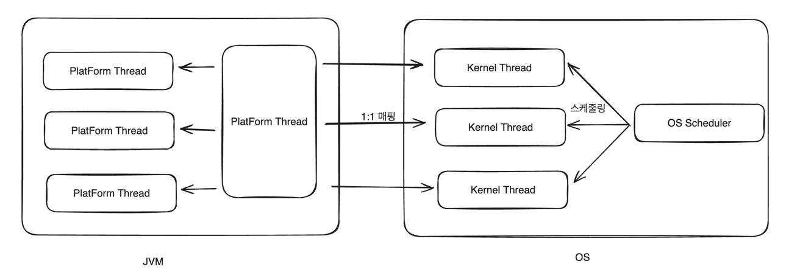

# 스레드 생성
## 개요
- 자바 스레드는 JVM에서 사용자 수준 스레드(User Thread)를 생성할 때 시스템 콜을 통해서 커널에서 생성된 커널 스레드와 1:1 매핑이 되어 최종적으로 커널에서 관리된다.
- JVM에서 스레드를 생성할때마다 커널에서 자바 스레드와 대응하는 커널 스레드를 생성한다.
- 자바에서는 Platform Thread로 정의되어 있다 .즉 OS 플랫폼에 따라 JVM이 사용자 스레드를 매핑하게 된다.

## Thread 구조

## 스레드 생성 하는 방법

1. Thread 클래스 상속하는 방법

- 작업 내용을 스레드 내부에 직접 재정의해서 실행

2. Runnable 인터페이스를 구현하는 방법

- 작업내용을 Runnable에 정의해서 스레드에 전달하면 스레드는 Runnable을 실행

## 다양한 스레드 생성 패턴

1. Thread 클래스 상속하는 방법
- 가장 기본적인 방식이며 Thread 클래스를 반드시 상속받아야 한다.
- 상속의 특성상 컴파일 타임 시점에 실행코드가결정되어 동적인 기능 변경이 불가능하다는 단점이 있음.

2. Thread 익명 클래스

- 스레드 객체를 참조하거나 재활용하지 않고 일회용으로만 사용할 겨웅

3. Runnable 인터페이스를 구현하는 방법
- Runnable을 태스크로 활용하는 방식으로서 선호하는 방식
- 스레드와 실행하고자 하는 태스크를 분리함으로써 좀 더 유연하고 확장 가능한 구조로 구현이 가능

4. Ruunable 익명 클래스

- Runnable 타입을 참조하거나 재활용하지 않고 일회용으로만 사용할 경우

5. Runnable 람다 방식

- Runnable을 람다 형식으로 구현함으로써 코드가 간결해진다.
