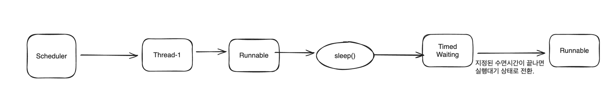
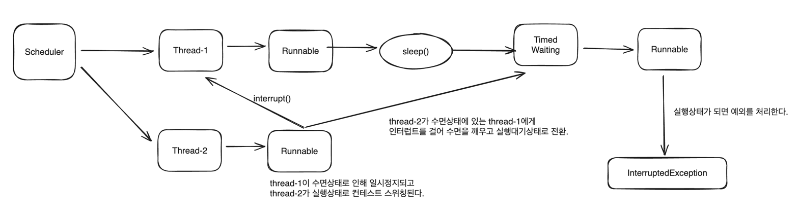
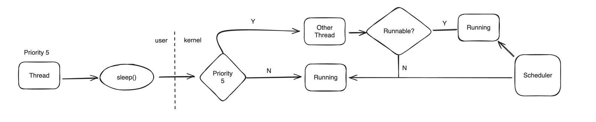
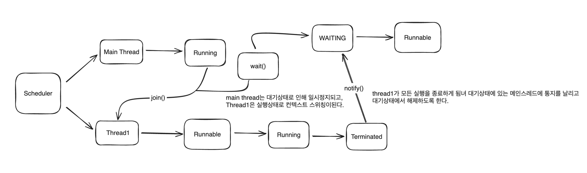
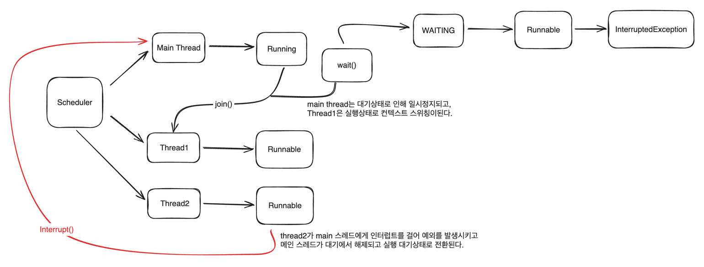
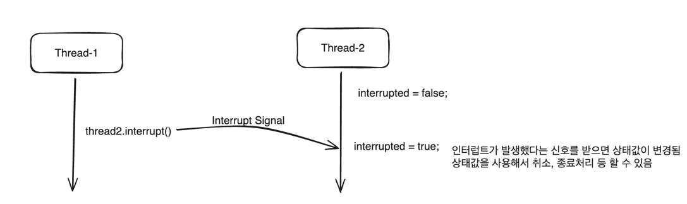
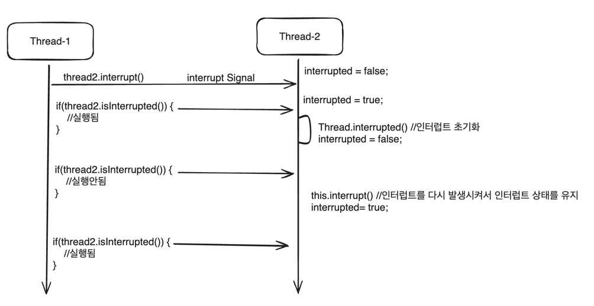
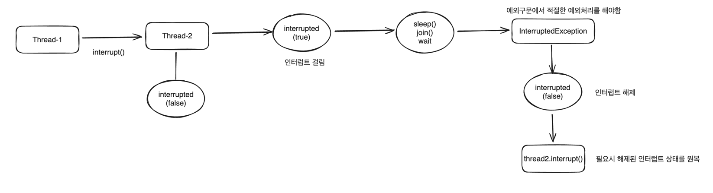

# sleep
## 개요
- sleep() 메서드는 지정된 시간동안 현재 스레드의 실행을 일시정지하고 대기상태로 빠졌다가 시간이 지나면 실행대기 상태로 전환된다.
- 네티이브 메서드로 연결되며 시스템 콜을 통해 커널모드에서 수행 후 유저모드로 전환한다.

## API 및 예외
- static sleep(long millis) throws InterruptedException
  - 지정된 밀리초 시간동안 스레드를 수면상태로 만든다.
  - 밀리초에 대한 인수 값은 음수가 될 수 없으며 음수일 경우 IllegalArgumentException이 발생한다.
- static sleep(long millis, int nanos) throws InterruptedException
  - 지정한 밀리초에 나노초를 더한 시간동안 스레드를 수면상태로 만든다.
  - 나노초의 범위는 0에서 999999이다.
- InterruptedException
  - 스레드가 수면중에 인터럽트 될 경우 InterruptedException 예외를 발생시킨다.
  - 다른 스레드는 잠자고 있는 스레드에게 인터럽트, 즉 중단(멈춤) 신호를 보낼 수 있다.
  - InterruptedException 예외가 발생하면 스레드는 수면상태에서 깨어나고 실행대기 상태로 전환되어 실행상태를 기다린다.

기본코드 방식
```java
try { //try-catch문으로 예외초리를 해주어야함.
    Thread.sleep(3000); // 3초간 일시정지
    //비즈니스 로직
}catch(InterruptedException e) {
    //인터럽트 발생 시 예외 처리
}
```

## Sleep() 작동방식

### 지정된 시간이 지남



### interrupt() 발생



## sleep(0)과 sleep(n)의 의미
- sleep(millis) 메서드는 네이티브 메서드이기때문에 sleep(millis)을 실행하게 되면 시스템콜을 호출하게 되어 유저모드에서 커널모드로 전환된다.
- 다른 스레드에게 명확하게 실행을 양보하기 위함이라면 sleep(0)보다는 sleep(1)을 사용하도록 한다.

### sleep(0)
- 스레드가 커널 모드로 전환한 후 스케줄러는 현재 스레드와 동일한 우선순위(Priority)의 스레드가 있을 경우 실행대기 상태 스레드에게 CPU를 할당함으로써 컨텍스트 스위칭이 발생한다.
- 만약 우선순위가 동일한 실행대기 상태의 다른 스레드가 없으면 스케줄러는 현재 스레드에게 계속 CPU를 할당해서 컨텍스트 스위칭이 없고 전환만 일어난다.



### sleep(n)
- 스레드가 커널모드로 전환 후 스케줄러는 조건에 상관없이 현재 스레드를 대기상태에 두고 다른 스레드에게 CPU를 할당함으로 모든 전환 후 함께 컨텍스트 스위칭이 발생한다.


## sleep() 작동방식 정리
- sleep()이 되면 OS 스케줄러는 현재 스레드를 지정된 시간 동안 대기 상태로 전환하고 다른 스레드 혹은 프로세스에게 CPU를 사용하도록 한다.(컨텍스트 스위칭 발생)
- 대기 시간이 끝나면 스레드 상태는 바로 실행상태가 아닌 실행 대기상태로 전환되고 CPU가 실행을 재개할때까지 가디린다.
- 실행상태가 되면 스레드는 남은 지점부터 실행을 다시 시작한다.
- 동기화 메서드 영역에서 수면중인 스레드는 획득한 모니터 락을 잃지 않고 계속 유지한다.
- sleep()중인 스레드에게 인터럽트가 발생할 경우 현재 스레드는 대기에서 해제되고 실행상태로 전환되어 예외를 처리하게 된다.
- 스레드의 수면시간은 OS 스케줄러 및 시스템 기능에 따라 제한되기 때문에 정확성이 보장되지 않으며 시스템의 부하가 많고 적음에 따라 지정한 수면시간과 차이가 날 수 있다.


# join
## 개요
- join() 메서드는 한 스레드가 다른 스레드가 종료될떄까지 실행을 중지하고 대기상태에 들어갔다가 스레드가 종료되면 실행대기 상태로 전환된다.
- 스레드의 순서를 제어하거나 다른 스레드의 작업을 기다려야 하거나 순차적인 흐름을 구성하고자 할 때 사용할 수 있다.
- Object 클래스의 wait() 네이티브 메서드로 연결되며 시스템 콜을 통해 커널모드로 수행한다. 내부적으로 wait() & notify() 흐름을 가지고 제어한다.

## API 및 예외처리
- void join() throws InterruptedException
  - 스레드의 작업이 종료될때까지 대기 상태를 유지
- void join(long millis) throws InterruptedException
  - 지정한 밀리초 시간동안 스레드의 대기 상태를 유지
  - 밀리초에 대한 인수 값은 음수가 될 수 없으며 음수 일 경우 InterruptedException이 발생
- void join(long millis, int nanos) throws InterruptedException
  - 지정한 밀리초에 나노초를 더한 시간동안 스레드의 대기 상태를 유지
  - 나노초의 범위는 0에서 999999
- InterruptedException
  - 대기중인 스레드가 인터럽트 될 경우 InterruptedException 예외가 발생
  - 다른 스레드는 join()을 수행중인 스레드에게 인터럽트, 즉 중단(멈춤) 신호를 보내 수 있음
  - InterruptedException 예외가 발생하면 스레드는 대기 상태에서 실행대기 상태로 전환되어 실행상태를 기다린다.

기본 코드 방식
```java
public static void main(String[] args) {
    Runnable r = new MyRunnable();
    Thread thread = new Thread(r);
    try { // try/catch 문으로 예외 처리해주어야함
        thread.join(); // 메인 스레드는 thread의 작업이 종료될때까지 일시정지
    }catch (InterruptedException e) {
        //인터럽트 발생시 예외 처리 필요
    }
}
```

## join() 작동방식
- wait() & notify()



- interrupt() 발생



## join() 작동방식 정리
- join()을 실행하면 OS 스케줄러는 join()을 호출한 스레드를 대기상태로 전환하고 호출 대상 스레드에게 CPU를 사용하도록 한다.
- 호출 대상 스레드의 작업이 종료되면 join()을 호출한 스레드는 실행대기 상태로 전환되고 CPU가 실행을 재개할때까지 기다린다.
- join()을 호출한 스레드가 실행 대기에서 실행 상태가 되면 그 스레드는 남은 지점부터 실행을 다시 시작한다.
- 호출 대상 스레드가 여러 개일경우 각 스레드의 작업이 종료될때까지 join()을 호출한 스레드는 대기와 실행을 재개하는 흐름을 반복한다.
- join()을 호출한 스레드가 인터럽트 되면 해당 스레드는 대기에서 해제되고 실행상태로 전환되어 예외를 처리하게 된다.


# interrupt

## 개요
- interrupt의 사전적 의미는 '방해하다' 라는 뜻으로 어떤 주체의 행동이나 실행흐름을 방해한다는 의미로 해석할 수 있다.
- 자바 스레드에서 interrupt()는 특정 스레드에게 인터럽트 신호를 알려줌으로써 스레드의 실행을 중단하거나, 작업 취소, 강제 종료 등으로 사용할 수 있다.

## interrupt()
- interrupt()는 스레드에게 인터럽트가 발생했다는 신호를 보내는 메카니즘이다.
- interrupt*()는 스레드가 현재 실행 흐름을 멈추고 인터럽트 이벤트를 먼저 처리하도록 시그널을 보내는 장치라 할 수 있다.
- interrupted 속성
  - 스레드는 인터럽트 상태(interrupt State)로 알려진 interrupted를 가지고 있으며 인터럽트 발생 여부를 확인할 수 있는 상태값이다. 기본값은 false이다.
  - 인터럽트된 스레드가 처리해야하는 특별한 규칙이나 정해진 기준은 없으나 일반적으로 인터럽트 상태를 사용해서 스레드를 중지하거나 작업을 취소하거나, 스레드를 종료 하는 등의 기능을 구현할 수 있다.
  - 한 스레드가 다른 스레드를 인터럽트 할 수 있고 자기 자신을 인터럽트 할 수 도 있다.
  - interrupt()하는 횟수는 제한이 없으며 인터럽트 할때마다 스레드의 인터럽트 상태를 true로 변경한다.



## 인터럽트 상태 확인방법
- static boolean interrupted()
  - 스레드의 인터럽트 상태를 반환하는 정적 메서드
  - 만약 현재 인터럽트 상태가 true인 경우 true를 반환하고 인터럽트 상태를 false로 초기화 하므로 인터럽트 해제하는 역할
  - 인터럽트를 해제하는 경우 다른곳에서 스레드에 대한 인터럽트 상태를 체크하는 곳이 있다면 별도의 처리가 필요할 수 있다.
  - 인터럽트를 강제로 해제했기때문에 다시 인터럽트를 걸어서 인터럽트 상태를 유지할 수 있다.



- boolean isInterrupted()
  - 스레드의 인터럽트 상태를 반환하는 인스턴스 메서드
  - 스레드의 인터럽트 상태를 변경하지 않고 계속 유지
  - 인터럽트 상태를 확인하는 용도로만 사용할 경우 interrupted()보다 해당 메서드를 사용하는것이 좋음

## InterruptedException
- InterruptedException은 interrupt() 메카니즘의 일부이며 대기나 차단 등 블로킹 상태에 있거나 블로킹 상태를 만나는 시점의 스레드에 인터럽트 할때 발생하는 예외
- InterruptedException이 발생하면 인터럽트 상태는 자동으로 초기화 된다. 즉 Thread.interrupted() 한 것과 같은 상태로 된다(interrupted = false)
- 다른곳에서 인터럽트 상태를 참조하고 있다면 예외 구문에서 대상 스레드에 다시 interrupt() 해야할 수 있다.
- InterruptedException이 발생하는 케이스
  - Thread.sleep(), Thread.join(), Object.wait()
  - Future.get(), BlockingQueue.take()



# Thread Name
- 멀티 스레드 환경에서 어떤 스레드가 실행중인지 알아야 할 경우 스레드에 사용자 이름을 지정하면 실행중인 스레드를 쉽게 찾을 수 있다.
- 디버깅할때 어떤 스레드가 무슨 작업을 하고 있는지 정확하게 파악하기 위해서 스레드 이름을 정하는것이 큰 도움이 된다.
- 자바에서 스레드가 생성되면 스레드 이름이 자동으로 주어진다.
  - 가장 먼저 생성되는 메인 스레드의 이름은 main
  - 스레드 이름은 Thread-0, Thread-1, Thread-2, .. Thread-n과 같이 0부터 순차적으로 숫자를 증가하면서 이름이 만들어진다.
- 자바에서 사용자가 스레드 이름을 정할 수 있으며 두가지 방법으로 가능하다.
  - 스레드 객체 생성시 인자로 전달
    - Thread myThread = new Thread([ThreadGroup],[Runnable],"myThread")
  - setName(String name)으로 설정
    - myThread.setName("myThread");
  - getName()으로 스레드 이름 참조
    - myThread.getName()

# currentThread
- Thread 클래스의 정적 메서드로서 현재 실행중인 스레드 개체에 대한 참조를 반환
- ex) Thread.currentThread().getName(), if(Thread.currentThread == thread)

# isAlive()
- 스레드가 살아 있는지 여부
- 스레드의 start() 메서드가 호출되고 스레드가 아직 종료되지 않은 경우 스레드가 활성화 상태인것으로 간주되어 true를 반환
