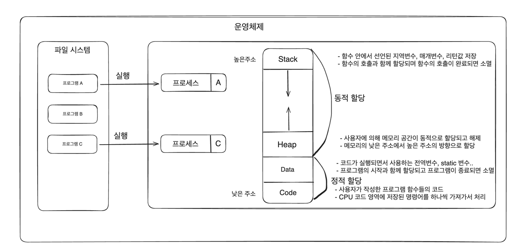
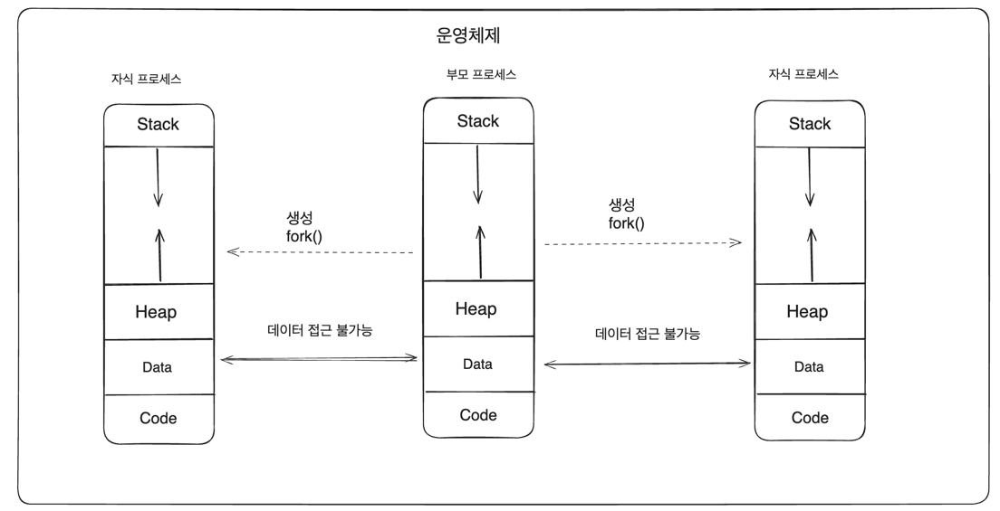

# 프로세스 & 스레드

## 프로세스
- 운영체제에 의해 파일 시스템에 설치되어 있는 파일을 프로그램이라고 부른다.
- 프로세스는 프로그램의 실제 실행의 의미하며 프로그램 파일을 실행함으로써 프로그램 데이터들이 메모리에 올라와 CPU를 할당받고 명령을 수행하고 있는 상태.
- 프로세스는 운영체제로부터 자원을 할당받은 최소 작업 단위.

- 운영체제는 프로세마다 각각 독립된 메모리 영역을 Code/Data/Heap/Stack의 형식으로 할당.
- 독립된 메모리 영역을 할당해주기 때문에 프로세스 간 영향을 받지 않고 독립적인 작업을 수행할 수 있음.
- 기본적으로 다른 프로세스의 변수나 자료에 접근할 수 없고 IPC나 공유메모리 등의 통신기법들을 사용해서 프로세스 간 통신해야 함.

## 스레드
- 스레드는 프로세스가 운영체제로부터 할당 받은 자원을 이용하는 실행단위 또는 흐름의 단위로서 하나의 프로세스는 반드시 하나 이상의 스레드를 갖는다.
- 프로세스 내에서 각 필요한 Stack만 할당받고 Code/Data/Heap 영역은 공유해서 각 스레드가 공유한다.
- 스레드 간 메모리 스택 영역에 접근할 수 없으므로 스레드는 독립적인 실행 흐름을 가질 수 있게 되어 독립적인 함수 호출이 가능해진다.

## 스레드 & CPU
- 스레드는 운영체제의 스케줄러에 의해 관리되는 CPU의 최소 실행단위를 의미.
- 스케줄러의 알고리즘에 따라 프로세스에 속한 한개의 스레드가 선점되어 CPU에 할당됨.
- 스레드 간 선점이 일어날때 CPU의 실행흐름(문맥)이 전환되는 컨텍스트 스위칭이 발생

## 프로세스 VS 스레드

### 프로세스
- 여러 개의 자식 프로세스 중 하나에 문제가 발생하면 그 자식 프로세스만 죽고 다른 프로세스에게 영향을 미치지 않는다. 즉 프로그램 전체의 안전성을 확보 가능
- 프로세스 간 전환(컨텍스트 스위칭) 시 레지스터, 캐시 메모리 초기화 등 무거운 작업으로 인한 시간적인 비용이 많이 발생
- 프로세스 간 통신 기법이 어렵고 복잡해서 통신으로 인한 오버헤드가 큼
- 프로세스 생성 시 독립적으로 메모리가 할당되기 때문에 리소스 비용이 큼

### 스레드
- 여러개의 스레드 중 하나에 문제가 발생하면 전체 프로세스에 영향을 미치게 된다.
- 프로세스의 메모리 영역을 공유하기 때문에 컨텍스트 스위칭 시간이 적고 리소스를 효율적으로 사용
- 스레드 간 통신비용이 적어 통신으로 인한 오버헤드가 작다.
- 스레드 간 공유 메모리 영역의 동시 접근으로 인한 동기화 문제가 발생한다.
- 하나의 스레드에서 오류가 발생할경우 프로세스 자체가 종료될 수 있다
