# 프로세스 & 스레드

## 프로세스
- 운영체제에 의해 파일 시스템에 설치되어 있는 파일을 프로그램이라고 부른다.
- 프로세스는 프로그램의 실제 실행의 의미하며 프로그램 파일을 실행함으로써 프로그램 데이터들이 메모리에 올라와 CPU를 할당받고 명령을 수행하고 있는 상태.
- 프로세스는 운영체제로부터 자원을 할당받은 최소 작업 단위.

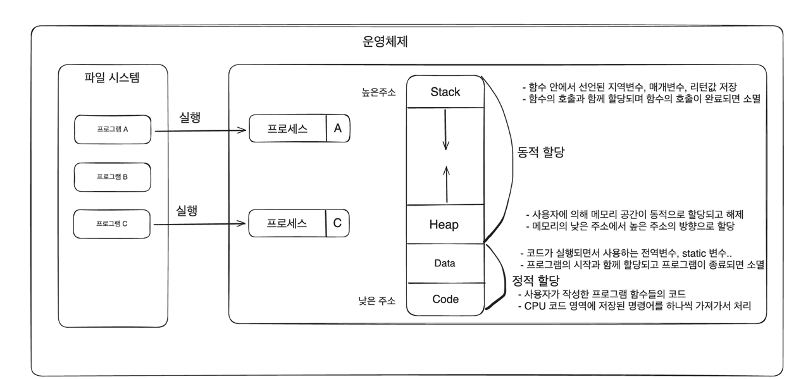

- 운영체제는 프로세마다 각각 독립된 메모리 영역을 Code/Data/Heap/Stack의 형식으로 할당.
- 독립된 메모리 영역을 할당해주기 때문에 프로세스 간 영향을 받지 않고 독립적인 작업을 수행할 수 있음.
- 기본적으로 다른 프로세스의 변수나 자료에 접근할 수 없고 IPC나 공유메모리 등의 통신기법들을 사용해서 프로세스 간 통신해야 함.

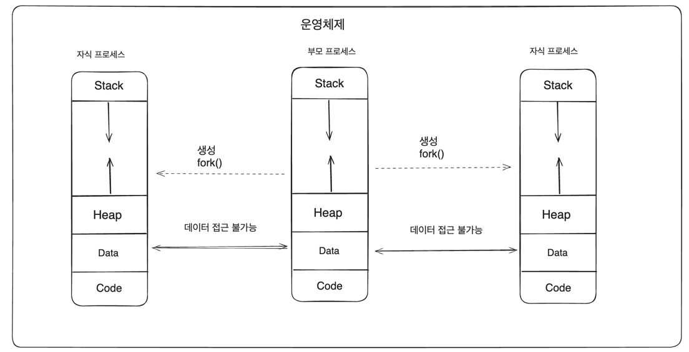

## 스레드
- 스레드는 프로세스가 운영체제로부터 할당 받은 자원을 이용하는 실행단위 또는 흐름의 단위로서 하나의 프로세스는 반드시 하나 이상의 스레드를 갖는다.
- 프로세스 내에서 각 필요한 Stack만 할당받고 Code/Data/Heap 영역은 공유해서 각 스레드가 공유한다.
- 스레드 간 메모리 스택 영역에 접근할 수 없으므로 스레드는 독립적인 실행 흐름을 가질 수 있게 되어 독립적인 함수 호출이 가능해진다.

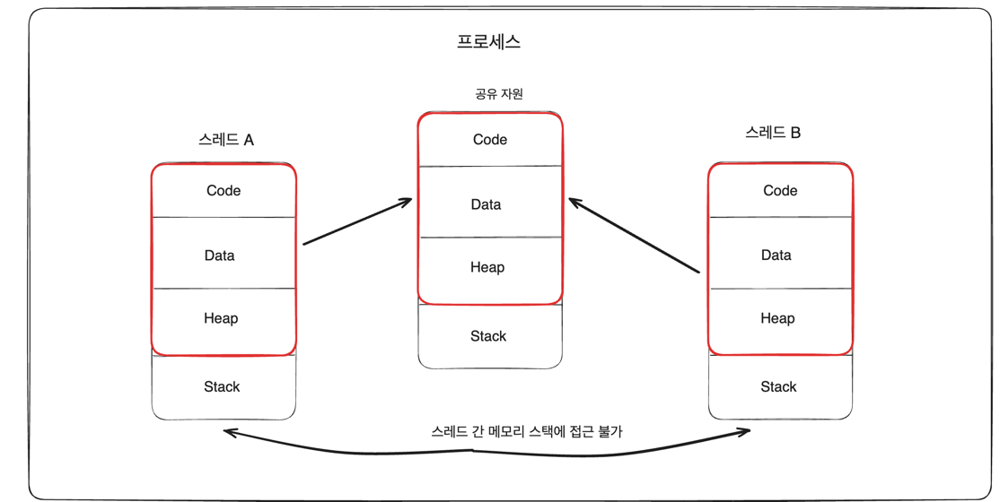

## 스레드 & CPU
- 스레드는 운영체제의 스케줄러에 의해 관리되는 CPU의 최소 실행단위를 의미.
- 스케줄러의 알고리즘에 따라 프로세스에 속한 한개의 스레드가 선점되어 CPU에 할당됨.
- 스레드 간 선점이 일어날때 CPU의 실행흐름(문맥)이 전환되는 컨텍스트 스위칭이 발생

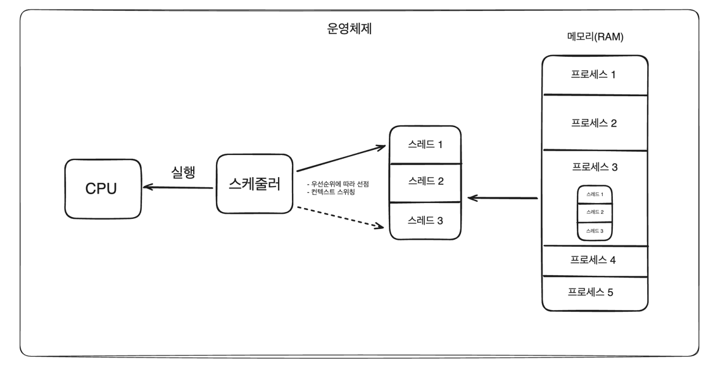

## 프로세스 VS 스레드

### 프로세스
- 여러 개의 자식 프로세스 중 하나에 문제가 발생하면 그 자식 프로세스만 죽고 다른 프로세스에게 영향을 미치지 않는다. 즉 프로그램 전체의 안전성을 확보 가능
- 프로세스 간 전환(컨텍스트 스위칭) 시 레지스터, 캐시 메모리 초기화 등 무거운 작업으로 인한 시간적인 비용이 많이 발생
- 프로세스 간 통신 기법이 어렵고 복잡해서 통신으로 인한 오버헤드가 큼
- 프로세스 생성 시 독립적으로 메모리가 할당되기 때문에 리소스 비용이 큼

### 스레드
- 여러개의 스레드 중 하나에 문제가 발생하면 전체 프로세스에 영향을 미치게 된다.
- 프로세스의 메모리 영역을 공유하기 때문에 컨텍스트 스위칭 시간이 적고 리소스를 효율적으로 사용
- 스레드 간 통신비용이 적어 통신으로 인한 오버헤드가 작다.
- 스레드 간 공유 메모리 영역의 동시 접근으로 인한 동기화 문제가 발생한다.
- 하나의 스레드에서 오류가 발생할경우 프로세스 자체가 종료될 수 있다

# 동시성 & 병렬성

## 개요
- 동시성 : 특정한 순서 없이 겹치는 기간에 시작, 실행 및 완료 되는 여러 작업에 관한것을 의미
- 병렬성 : 멀티코어 프로세서에서 동시에 실행되는 동일한 작업의 여러 

## 동시성
- CPU가 한번에 많은 일을 처리하는것에 중점. 즉 많은 작업들을 아주 빠른 시간으로 교체하면서 전체 작업을 처리.
- 작업의 처리를 빠르게 하기 위한 목적이 아닌 CPU를 효율적으로 사용하는 것에 더 중점을 둔다.
  - 스레드가 작업을 처리하다가 I/O 블록에 걸렸을경우 CPU는 다른 스레드로 전환해서 작업을 진행 -> I/O에 대한 작업은 CPU담당이 아니기 때문에 I/O 블록으로 인해 대기하기보다는 다른 스레드로 전환해서 작업을 진행하는것이 효율적
- 작업에 대한 처리 방식을 어떤식으로 진핼할것인가에 대한 설계적 관점에서 이해해야 함.
- 작업해야할 수가 CPU 코어 수보다 많을 경우 해당되며 동시성이 없으면 작업을 순차적으로 진행해야함.
  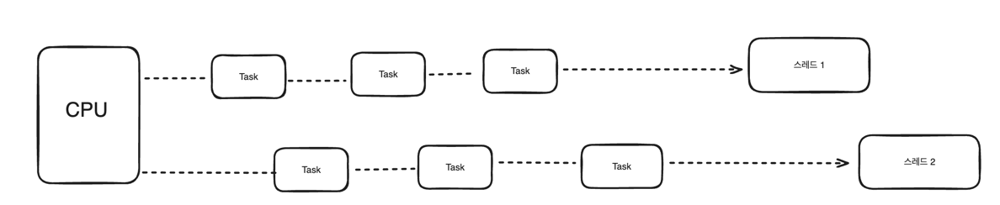

## 병렬성
- CPU가 동시에 많은 일을 수행하는것에 중점을 둔다. 즉 CPU가 놀지 않고 최대한 바쁘게 동작해야함.
-  런타임에 동시에 물리적으로 작업을 실행하는것이며 여러 컴퓨팅 리소스가 있는 하드웨어가 필요하다. 한개의 코어에서는 절대 병렬성 구현될 수 없다.
- 동시성의 하위 개념으로 여러 작업을 여러 스레드로 분리하고 운영체제는 그 스레드를 여러 CPU에 적절히 분배하여 동시적으로 실행되도록 하는것
- 동시성이 작업 처리방식에 대한 설계에 관한것이라면 병렬성은 하드웨어에 계층에서 작업 수행방식에 관한것
- 작업해야할 수가 CPU 코어 수보다 같거나 적을 경우 가장 효율

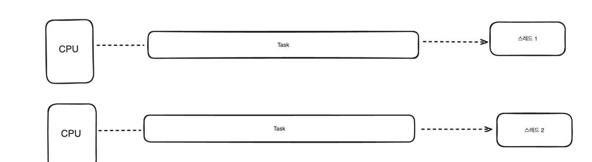

## 병렬성과 동시성 조합

### ThreadPoolExecutor
- 병렬성으로 처리 성능을 극대화 하고 동시성으로 CPU 자원을 효율적으로 운용한다.

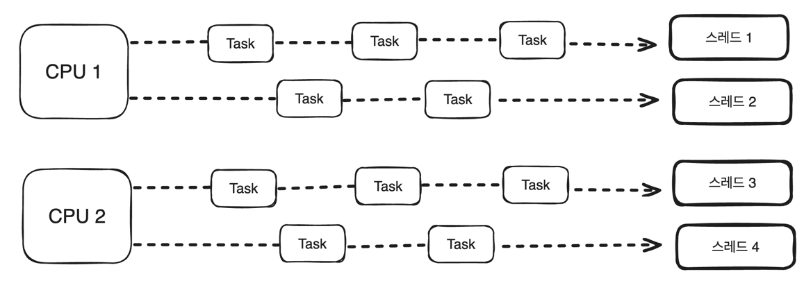

## Parallelism - Divide and Conquer

### ForkJoinPool
- 하나의 태스크를 서브 태스크로 분할하여 병렬처리함으로써 전체 작업 성능을 높임

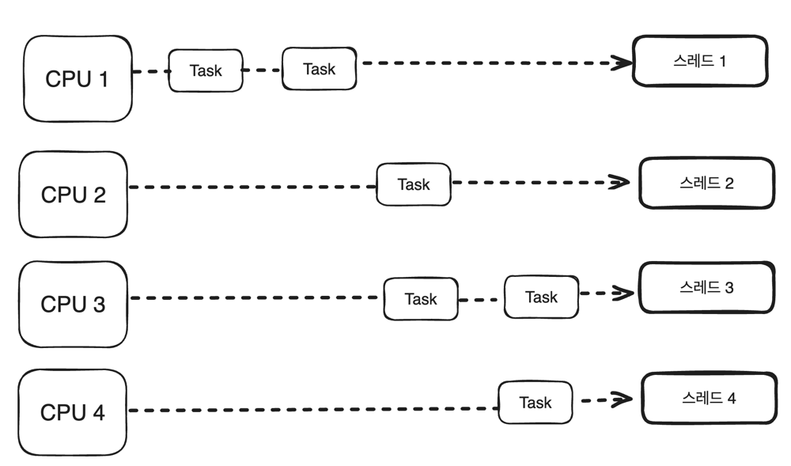

# Context Switch

## 개요
- 하나의 CPU는 동일한 시간에 하나의 작업(Task)만 수행할 수 있기때문에 여러 프로세스를 동시에 실행할 수 없다.
- 하나의 CPU에서 여러 프로세스를 동시성으로 처리하기 위해서는 한 프로세스에서 다른 프로세스로 전환해야하는데 이것을 컨텍스트 스위치리라고 함.

## Context(문맥)
- 프로세스 간 전환을 위해서는 이전에 어디까지 명령을 수행했고, CPU Register에는 어떤 값이 저장되어 있는지에 대한 정보가 필요함.
- Context는 CPU가 해당 프로세스를 실행하기 위한 프로세스의 정보를 의미하며 이 정보들은 운영체제가 관리하는 PCB라고 하는 자료구조의 공간에 저장됨

## PCB(Process Control Block)
- 운영체제가 시스템 내의 프로세스들을 관리하기 위해 프로세스마다 유지하는 정보를 담는 커널 내의 자료구조
- 컨텍스트 스위칭은 CPU가 프로세스 간 PCB정보를 교체하고 캐시를 비우는 일련의 과정이라 볼 수 있다.

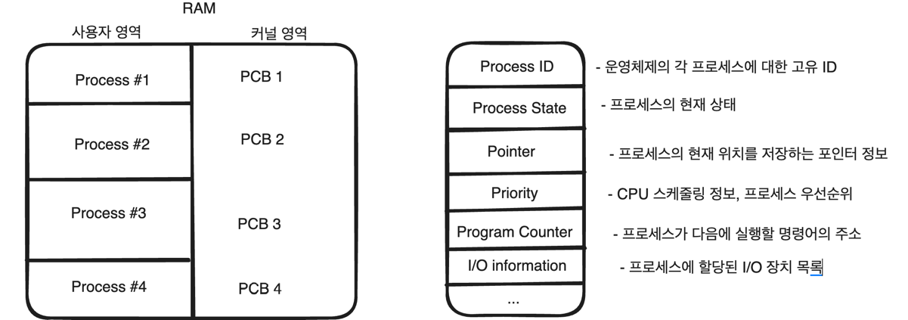

## 프로세스 상태
- 프로세스는 New(생성), 준비(Ready), 실행(Running), Blocked(대기), Exit(종료) 상태를 가진다.

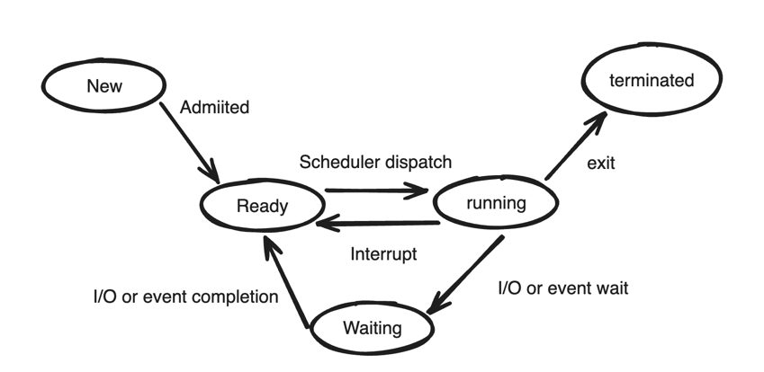

- New : 프로세스를 생성하고 있는 단계로 커널 영역에 PCB가 만들어진 상태
- Ready : 프로세스가 CPU를 할당받기 위해 기다리고 있는 상태
- Running : 프로세스가 CPU를 할당받아 명령어를 실행중인 상태
- Waiting: 프로세스가 I/O 작업 완료 혹은 사건 발생을 기다리는 상태
- Terminated: 프로세스가 종료된 상태

## 컨텍스트 스위칭이 일어나는 조건
- 실행중인 프로세스에서 I/O 호출이 일어나 해당 I/O 작업이 끝날때까지 프로세스 상태가 Running에서 Waiting 상태로 전이된 경우
- Round Robin 스케쥴링 등 운영체제의 CPU 스케줄러 알고리즘에 의해 현재 실행중인 프로세스가 사용할 수 잇는 시간 자원을 모두 사용했을 때 해당 프로세스를 중지하고 (ready 상태로 전이) 다른 프로세스를 실행시켜주는 경우

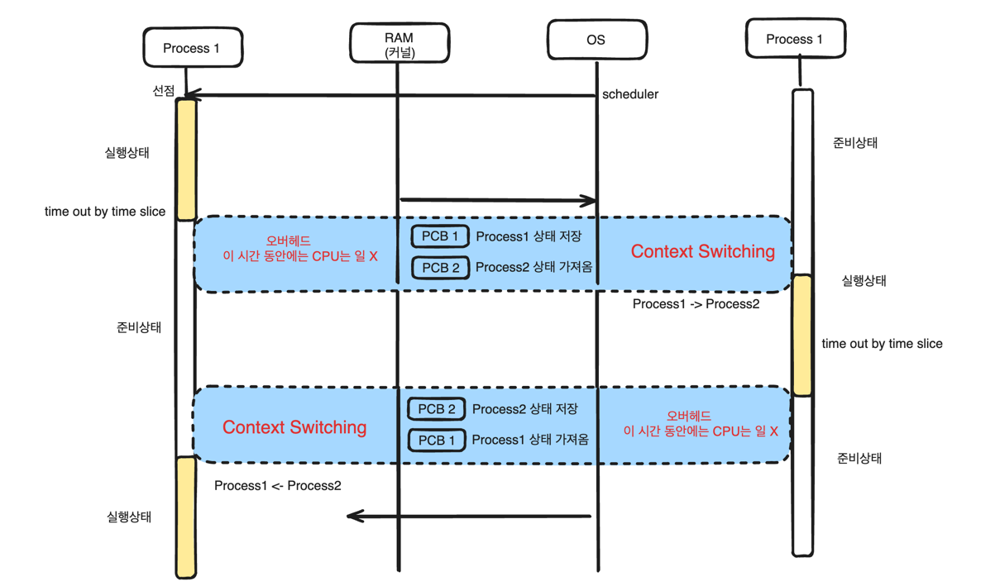

## 스레드 컨텍스트 스위칭

### TCB(Thread Control Block)
- Thread 상태정보를 저장하는 자료구조이며, PC와 Register Set(CPU 정보), 그리고 PCB를 가리키는 포인터를 가짐
- 스레드가 하나 생성될 때마다 PCB내에서 TCB가 생성되며 컨텍스트 스위칭이 일어나면 기존 스레드 TCB를 저장하고 새로운 TCB를 가져와실행

### 프로세스 vs 스레드
- 프로세스는 컨텍스트 스위칭 할 때 메모리 주소 관련 여러가지 처리(CPU 캐시 초기화, TLB 초기화 등..)를 하기 때문에 오버헤드가 큼
- 스레드는 프로세스 내 메모리를 공유하기 때문에 메모리 주소 관련 추가적인 작업이 없어 프로세스에 비해 오버헤드가 작아서 컨텍스트 스위칭이 빠름.
- 스레드는 생성하는 비용이 커서 많은 수의 스레드 생성은 메모리 부족 현상이 발생하거나 빈번한 컨텍스트 스위칭으로 인해 애플리케이션 성능이 저하될 수 있음.

